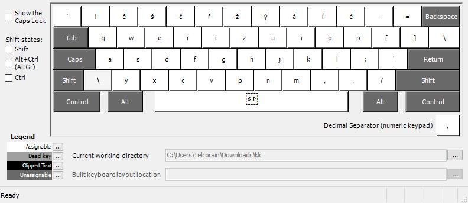
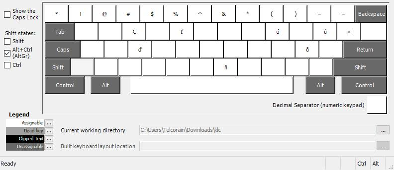

# "Czenglish" rozložení klávesnice

Moje vlastní rozložení klávesnice pro Windows a macOS. Vzniklo na základě situací, kdy člověk střídá češtinu, angličtinu a technický zápis, ale nechce mezi tím neustále přepínat. Zároveň jsem od malička zvyklý na rozložení QWERTZ ve smyslu polohy Z a Y, snahu o přeučení se na QWERTY jsem jednou pro vždy vzdal, nejsem toho schopen, i když se jedná jen o dvě hloupé klávesy.

## Základní myšlenka

- **písmenná část** zůstává česká v uspořádání QWERTZ,
- **české diakritické znaky** a **číslice** v horní řadě zůstávají taktéž jako na české QWERTZ,
- **symboly mimo "českou textovou část"** se chovají jako na EN-US QWERTY.

## Detailně

Samotné rozložení je poskládané takto:

- **písmenná část** -> česká QWERTZ,
- **řádek s číslicemi**:
    1. **výchozí stav**: české znaky s diakritikou,
    2. **Shift**: číslice,
    3. **AltGr/Option**: symboly jako na EN-US klávesnici,
- **symboly mimo písmennou část a numerický řádek** -> jako na EN-US klávesnici,
- **výjímky**:
    - `ú`: na pozici jako v CZ QWERTZ, aktivováno přes **AltGr/Option**,
    - `ů`: na pozici jako v CZ QWERTZ, aktivováno přes **AltGr/Option**,
    - `ť`: na pozici klávey `T`, aktivováno přes **AltGr/Option**,
    - `ď`: na pozici klávey `D`, aktivováno přes **AltGr/Option**,
    - `ň`: na pozici klávey `N`, aktivováno přes **AltGr/Option**,
    - `ó`: na pozici klávey `O`, aktivováno přes **AltGr/Option**.

## Náhled rozložení

Níže jsou přiložené náhledy z Windows varianty. Logika rozložení je stejná i pro macOS.

<figure style="text-align: center;">
    <figcaption>Obr. 1: Základní vrstva</figcaption>
    
</figure>

<figure style="text-align: center;">
    <figcaption>Obr. 2: Shift vrstva</figcaption>
    
</figure>

<figure style="text-align: center;">
    <figcaption>Obr. 3: AltGr vrstva</figcaption>
    
</figure>

## V čem se liší od běžných rozložení

### Oproti CZ QWERTZ

Proti klasickému českému QWERTZ zůstává zachované rozložení písmen i česká logika diakritiky. Největší rozdíl je v symbolových klávesách: závorky, apostrof, uvozovky, lomítka, zpětné lomítko, svislítko, čárka, tečka a další znaky jsou rozmístěné po anglicku. Díky tomu je rozložení výrazně příjemnější při psaní kódu nebo technického textu.

### Oproti CZ QWERTY

Proti českému QWERTY se toto rozložení vrací k české variantě QWERTZ, takže `Z` je nahoře a `Y` dole. Zároveň ale stejně jako výše opouští klasické české umístění řady symbolů a přesouvá je na pozice známé z US klávesnice.

### Oproti US QWERTY

Oproti americkému US QWERTY se naopak zachovává český základ pro psaní textu:

- písmena jsou v uspořádání QWERTZ,
- horní řada nese české znaky s diakritikou,
- doplňkové české znaky jsou dostupné přes AltGr/Option,
- symboly na numerické řadě je nutno psát přes AltGr/Option,
- číslice je nutno psát přes Shift.

# Obsah projektu

Projekt obsahuje dvě samostatné varianty stejné myšlenky:

- Windows varianta je definovaná v souboru `Win/csen.klc` a byla vytvořena v Microsoft Keyboard Layout Creator.
- macOS varianta je uložená jako bundle `Mac/CSEN.bundle`; samotný soubor `.keylayout` byl vytvořen a upravován v nástroji Ukelele.

## Instalace ve Windows

Hotový instalační balíček je ve složce `Win/csen/`.

1. Otevřete složku `Win/csen`.
2. Spusťte `setup.exe`.
3. Dokončete instalaci. Pokud si Windows vyžádají oprávnění správce, instalaci potvrďte.
4. Po instalaci přepněte rozložení kláves zkratkou `Win + Space`.
5. Pokud se nové rozložení neobjeví hned, odhlaste se a přihlaste znovu, případně restartujte počítač.

Pokud by z nějakého důvodu nešlo použít `setup.exe`, ve stejné složce jsou i odpovídající `.msi` balíčky pro jednotlivé architektury.

## Instalace v macOS

Varianta pro macOS je v repozitáři uložená jako hotový bundle vytvořený v Ukelele. Pro běžné používání Ukelele nepotřebujete; hodí se hlavně tehdy, pokud byste chtěli rozložení dál upravovat.

1. Zkopírujte `Mac/CSEN.bundle` do `~/Library/Keyboard Layouts` pro aktuálního uživatele.
2. Pokud má být rozložení dostupné pro všechny uživatele systému, zkopírujte bundle místo toho do `/Library/Keyboard Layouts`.
3. Odhlaste se a znovu přihlaste, případně restartujte macOS.
4. Otevřete `Nastavení systému > Klávesnice > Zdroje vstupu`.
5. Přidejte nové rozložení `Česko-anglická (QWERTZ)`.

Pokud si chcete rozložení pro macOS prohlédnout nebo upravit, otevřete příslušný `.keylayout` soubor v Ukelele a z něj znovu vyexportujte bundle.

## Soubory v repozitáři

- `Win/csen.klc` je zdrojová definice pro Windows.
- `Win/csen/` obsahuje hotový instalační balíček pro Windows.
- `Mac/CSEN.bundle` obsahuje hotové rozložení pro macOS.

# Pro koho to dává smysl (podle AI)

Tohle rozložení dává největší smysl člověku, který:

- pravidelně píše česky i anglicky,
- používá české QWERTZ,
- ale nechce při práci přicházet o pohodlí amerického rozmístění symbolů.

Pokud jste si někdy říkali, že česká klávesnice je skvělá na text, ale US je výrazně praktičtější na vše okolo, přesně tohle je pokus vzít si z obou to užitečné.
